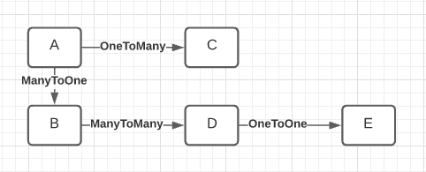
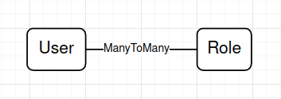
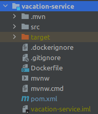

# JE 140

## Задачи Первого модуля

### 1.1 Задание
  * Создание мультимодульного проекта с помощью Maven
  * Название модулей: 
    * web-app,
    * data_base-app, 
    * service-app
  * В каждом модуле должна быть идентичная структура корневых каталогов
      * /src/main/java/by/ita/je/
      * /src/test/java/by/ita/je/
  * Каждый модуль полностью независим и собирается в jar файл

### 1.2 Задание
  * В модуле 1 создать класс M1App.java в котором реализовать пустой стартер.
  * В модуле 1 создать класс FirstService.java
    * Класс должен содержать метод, не пустой с минимум 1 параметром, 
      без использования примитивных типов
    * Напишите тест к этому методу.

### 1.3 Задание
  * Подключить репозиторий к своему проекту
  * Сделать запрос на добовление изменений в ветку с вашей фамилией
  * Пройти ревью и получить разрешение на слияние вашей локальной ветки с удаленной

### 1.4 Задание
  * Переоформить все модули в Spring Boot проекты, собраные мавеном.
  * Каждый спринг модуль должен подниматься на собственном порту
    * порты: web-app = 8001
    * порты: data_base-app = 8003
    * порты: service-app = 8004
  * Каждый спринг модуль должен иметь собственный contextPath соответственно
    * contextPath: /web-app
    * contextPath: /data_base-app
    * contextPath: /service-app
  * Сделать запрос на добовление изменений в ветку с вашей фамилией
  * Пройти ревью и получить разрешение на слияние вашей локальной ветки с удаленной
  
## Задачи модуля
Каждое задание оформляем в отдельной ветке, отдельным МР, формат имен для веток `2-1-wasileuski`, в МР добавляем майлстоун соответствующего модуля

### 2.1 Задание 
  * Соблюдайте правила "слоения" и структуру папок в проекте, `SOLID` принципы!
  * В модуле `data_base-app` создать 4 сущности `MODEL`, разного назначения.
    * Пользоваться Ломбоком, нельзя!
    * В каждой сущности должно быть минимум 8 полей, не больше 2 одинаковых типов полей на класс.
    * Сущности должны собираться через паттерн `Builder`.
    * В каждой сущности должно быть одно поле типа `ZoneDateTime`.
  * В модуле `data_base-app` создать 4 сущности `DTO` согласно вашим моделям.
    * В ваших `DTO` не должны быть показано поле `ZoneDateTime` типа.
    * `DTO` должны иметь в общем на 2 поля меньше чем соответствующая `MODEL`.
  * В модуле `data_base-app` создать `REST` контроллеры, для `CRUD` задач под каждую созданную `DTO`(отдельный класс контроллер для каждой дто).
    * Чтение всех записей, удаление списком, поиск списком обязательны
    * Реализовать контроллеры используя переменные пути, переменные запроса, тело запроса. Не нарушая конвенцию типов запросов и их назначения!
    * Контроллеры должны возвращать ответы `DTO` сущностями в формате `JSON`.
    * Маппинг контроллеров должен содержать существительные, говорящие о назначении эндпоинта.

### 2.2 Задание
  * Соблюдайте правила "слоения" и структуру папок в проекте, `SOLID` принципы!
  * В модуле `data_base-app` создать `DAO` для каждой модели.
  * В модуле `data_base-app` создать папку с исключениями.
    * Создать 2 исключения, для случая если данные не были найдены, или полученные данные не корректны/полны.
    * Исключения обязательно имеют конструктор со строковым параметром, куда мы будем передовать поясняющий текст.
    * В конструкторе исключений пишем лог, для логгера можно использовать ломбок.
  * В модуле `data_base-app` создать `Service` для каждого `DAO`.
    * В сервисах должны добавляться данные, которых не было в `DTO`(кроме `ID`)
    * Вы можете добавить небольшую логику на свое усмотрение, для полей которые не были получены из вне.
    * Если данные полученные из вне не позволяют создать модель, вы должны бросить исключение.
    * Процесс маппинга `DTO` в `MODEL` и обратно, не должен быть частью логики сервиса, сервис в идеале не должен знать об `DTO`.
    * Поиск единичных элементов должен возвращать либо данные, либо бросать исключение.
  * Для каждого открытого метода сервиса должен быть написан тест, используйте `JUNIT` и `Mockito`.
    * Для каждого метода, тест должен покрывать "позитивный случай", когда метод отрабатывает как положено и если метод может бросать исключения, то пишем тест для этого случая.
  * В модуле `data_base-app` создать подключение к базе, используйте `H2` в режиме "в памяти".

### 2.3 Задание
  * Установите `Postman` и проверьте все ваши контроллеры.
    * Создайте коллекцию в `Postman`, с папками для каждого из ваших контроллеров.
    * В каждой папке, должны быть сохранены все запросы на контроллер.
    * Создайте папку в проекте `postman-uat` и экспортируйте туда свою коллекцию.

### 2.3.1 Задание (Опционально)
  * После выполнения 2.3 вы можете перевести все ваши модели и дто на ломбок.
  * В следующих заданиях можете полноценно использовать ломбок для ваших `POJO`.

### 2.4 Задание
* Соблюдайте правила "слоения" и структуру папок в проекте, `SOLID` принципы!
* Соблюдайте соглашения по именовании форматирование кода.
* Добавьте в ваши модели 1 сущность типа `ENUM` для определения неких константных состояний.
    * Оберните ваш `ENUM` в обычный клас для более простого управления сущностями.
    * Для данной модели, ваше дао должно быть реализовано на уровне Hibernate, с помощь `EntityManger`.
    * Не используйте аннотации для управления транзакциями.
    * Для данной сущности контроллер делать не нужно.
* Из ваших 4-х(A,B,C,D) моделей соберите структуру, с логическим и очевидным бизнес процессом, опираясь на схему 
      ниже, где E это 5-ая созданная вами модель `ENUM`.
      
  
      
    * Создайте отдельный сервис для бизнес процесса который будет работать с 4 мя предыдущими.
    * Этот сервис должен иметь поведение, - процесс добавления данных для А, обогащения А данными из В и С, так
    же должна быть описана логика по добавлению данных D и E по условию. Этот сервис не может на прямую обращаться к `DAO A,B,C,D,E`.
    * Этот сервис должен иметь поведение, - изменения данных А и связанных с ним C, B, D, E.
    * Этот сервис должен иметь поведение, - чтение А с глубиной вложенности до В, С.
      * Возвращаемая `DTO` должна содержать данные только о сущностях A, B, C.
      * В будущем вам необходимо сделать тест, который проверит количество возвращаемых данных для этого метода
    * Этот сервис должен иметь поведение, - удаление А и всех ЗАВИСИМЫХ от А сущностей. Т.е. Если записи А не 
      существует, то смысл существования записей B,C,D,E пересматривается (зависит от бизнес логики ваших связей).
    * Новый сервис назовите `BuisnessService`.
* `DTO` должны отображать связи моделей аналогичным образом.
* Создайте контроллер по нужды вашего сервиса.

### 2.5 Задание
* Соблюдайте правила "слоения" и структуру папок в проекте, `SOLID` принципы!
* Соблюдайте соглашения по именовании форматирование кода.
* Создайте метод в вашем контроллере из задания 2.5, который будет принимать `FiltedDTO`.
    * `FiltedDTO` - позволяет передавать информацию для поиска по полям классов A,B,C,D и E.
    * Для числовых значений вы можете задавать диапазон "подходящих результатов".
* Создайте метод для вашего сервиса из 2.5, который опираясь на данные `FiltedDTO` будет производить поиск по таблицам.
    * Таблица А ваш опорный элемент для поиска, результат поиска всегда предполагает возвращение А сущности, 
      со вложенностью определенной критериями поиска. Например вы ищите все А у которых есть элементы E, то выш вывод 
      должен включать все данные по иерархической цепочке от А до Е.
    * Добавляйте новые методы поиска в новый `DAO`. Например `SearcherDao`.
    * Для запросов к базе данных нужно использовать хотя бы раз подходы:
        * [JPQL](https://www.baeldung.com/spring-data-jpa-query)
        * [HQL](https://www.baeldung.com/hibernate-named-query)
        * [Criteria Queries](https://www.baeldung.com/hibernate-criteria-queries)
    * Используйте - [Metamodel](https://www.baeldung.com/hibernate-criteria-queries-metamodel) в качестве констант 
      для имен полей таблиц.
    * В каждом запросе поиска вы должны использовать как минимум 2 критерия, т.е. по 2 полям. Одно поле из А сущности, второе из Любой другой.
* Напишите тесты для всех новых методов. Только юнит тесты, базу и запросы в базу тестить не нужно.
* Создайте контроллер по нужды вашего сервиса.

### 3.0 Задание
* Соблюдайте соглашения по именовании форматирование кода.
* Напишите [скрипт](https://www.baeldung.com/spring-boot-h2-database) для создания вашей базы и наполнения ее данными.
  * Скрипт в виде файла `data.sql` положите в `src/main/resources`.
  * Скрипт должен:
    * Удалять уже существующие таблицы, на момент старта вашего приложения.
    * Создавать все представленные в вашей системе сущности
    * Создавать отношения аналогичные сущностям в системе.
    * Каждая сущность должна быть наполнена данными, минимум 4 записи на сущность.

### 3.1 Задание
* Напишите тесты вашей для `SearcherDao`, в данном случае мы тестируем только запросы на поиск для сервиса созданного в 2.5 в которых мы используем `FiltedDTO`.
* ВНИМАНИЕ! Вы тестируете только `DAO` 
* Для тестового контекста напишем [скрипт](https://www.baeldung.com/spring-boot-h2-database) аналогичный пункта 3.0 только данные для него определяются необходимостью тестирования. Т.е. вы в тестовом скрипте добавляете ровно столько данных сколько вам необходимо для "позитивных" тестов ваших запросов.
* Обязательно [разделяйте контекст/профилирование](https://www.baeldung.com/spring-testing-separate-data-source) на тестовое и "боевое".
* Классы тестов, что тестируют базу данных должны оканчиваться на `IT`, например `MyServiceIT.java`. И должны быть размещены в отдельной папке тестового ветвления. Т.е. все классы содержащие `IT`, должны быть в одной папке.

### 3.2 Задание
* Аналогично 3.1 напишите тесты для `BuisnessDao`.
  * Новый скрипт писать не нужно использовать старый для тестов.
* Добавьте необходимые денные в скрипт по сборке базе данных для тестов.

### 4.0 Задание
* В модуле `web-app` напишите сервис, который с помощью `RestTemplate` [ходит](https://www.baeldung.com/rest-template) на контроллеры `data_base-app` сервиса.
  * Модуль `web-app` не должен знать ничего о моделях других модулей, `DTO` не модель.
* Модуль `web-app` должен иметь только `@Controller` для запросов из 2.4 и 2.5.
* Т.к. модуль `web-app` использует `@Controller`, мы должны создать для них статические ресурсы по 1 странице для каждого запроса
  * Используйте [Thymeleaf](https://www.baeldung.com/thymeleaf-in-spring-mvc) для работы с моделью.
  * Данные передаются через модель.
  * Все Страницы должны быть размещены в `resources/templates`.
* Модуль `web-app` не должен хранить никаких данных. 
* Модуль должен валидировать все входящие данные и в случае несоответствия, НЕ ломать страницу представления для этих данных, а подсвечивать их красным, или выдавать всплывающее окно с описанием проблемы.
* 
### 4.1 Задание
* Напишите [контроллер](https://www.baeldung.com/exception-handling-for-rest-with-spring), для обработки ошибок возвращаемых с модуля `data_base-app` для запросов из `web-app`. Ошибки обрабатывать отдельной страничкой, с помощью `@AdviceController` (только для `web-app`), на странице должна быть гиперссылка/кнопка, для возврата на главную страницу.

### 4.2 Задание
* В модуле `web-app` необходимо добавить аутентификацию и авторизацию.
* Создайте в приложении модели для новой базы данных:
* 
  
* Модель `Users` должна содержать как минимум 4 поля.
  * ID
  * LOGIN - (уникальное поле)
  * PASSWORD - (пароль должен быть зашифрован перед хранением)
    * [вы можете написать мини приложение для получения шифрованного пароля, который вы сохраните в базу](https://www.baeldung.com/spring-security-registration-password-encoding-bcrypt)
  * ROLES (ManyToMany)
* Модель `Roles` должна содержать как минимум 2 поля. Данная модель может не иметь обратной ссылки на модель `Users`. Поля модели - `ID, ROLE_NAME`, - нам необходимо создать роли:
  * READER - только `GET` запросы и только чтение информации.
  * EDITOR - может `PUT` запросы, только изменение информации.
  * AUTHOR - может `POST`, `DELETE` запросы, т.е. вся логика создания и удаления информации.
* Роли не абсолютные, т.е. - вы можете комбинировать, например, что бы пользователь имел полный доступ к данным, у него сущности должны быть все известные роли - `[READER, EDITOR, AUTHOR]`.
* Создайте подключение к базе данных в памяти.
* Пишем скрипты для создания баз данных согласно описанным модулям:
  ```sql
      CREATE TABLE `users` (
          ...
      );
        
      CREATE TABLE `roles` (
          ...
      );
  ```
* Пишем скрип для записи данных о наших пользователях в БД.
  * Создайте пользователей, один из них может все, другой может только читать, третий может читать и изменять, но не может создавать и удалять.
  * Пример записи о пользователе, обратите внимание, что пароль зашифрован в базе:
  ```sql
  INSERT INTO `users` (`username`, `password`) VALUES ('admin', '$2a$10$IqTJTjn39IU5.7sSCDQxzu3xug6z/LPU6IF0azE/8CkHCwYEnwBX.');
  ```
### 4.3 Задание ([шпаргалка](https://www.codejava.net/frameworks/spring-boot/spring-boot-security-role-based-authorization-tutorial))
* Подключаем модуль аутентификации и авторизации.
  ```
    <dependency>
    <groupId>org.springframework.boot</groupId>
    <artifactId>spring-boot-starter-security</artifactId>
    </dependency>  
  ```
* Пишем `CrudRepository<Users, Long>`(можно создать `DAO` аналогично, любым другим известным способом)
    * В `DAO` у нас должен быть 1 метод, который по полю `LOGIN`, находит запись о пользователе.
* Создаем Специальную сущность на базе интерфейса `org.springframework.security.core.userdetails.UserDetails`.
  * Основной элемент безопасности реализованный в `Spring` базируется на ваших реализациях `UserDetails`, `UserDetailsService`. Где `UserDetails` являться оберткой для вашей модели с данными об пользователе, а интерфейс указывает на ожидаемое поведение.
* Создаем сервис на базе `org.springframework.security.core.userdetails.UserDetailsService`, который выполняет бизнес логику вашей безопасности.
  * У нас она примитивна, мы заворачиваем нашу модель в известную для `Spring.Security` оболочку.
    ```
    @Override
    public UserDetails loadUserByUsername(String username)
            throws UsernameNotFoundException {
        User user = userRepository.getUserByUsername(username);
         
        if (user == null) {
            throw new UsernameNotFoundException("Could not find user");
        }
         
        return new MyUserDetails(user);
    }
    ```
    
* Последний этап, это настройка конфигурации вашей безопасности.
  * Создаем конфигурацию и аннотируем ее как конфигурацию безопасности. Конфигурация реализует ожидаемое поведение через интерфейс `WebSecurityConfigurerAdapter`. Существует множество других, но в данном случае нам достаточно этого.
    ```
        @Configuration
        @EnableWebSecurity
        public class WebSecurityConfig extends WebSecurityConfigurerAdapter {...}
    ```
  
  * Реализуем методы для `WebSecurityConfigurerAdapter`:
    * Метод передающий управление процессом аутентификации пользователей:
    ```
        protected void configure(AuthenticationManagerBuilder auth) throws Exception {
           auth.authenticationProvider(<ссылка на Поставщика Услуг по Аутентификации>)
        }
    ```
    * Т.к. у нас еще нет "Поставщика Услуг по Аутентификации", создадим `@Bean` для него.
    ```
        @Bean
        public DaoAuthenticationProvider authenticationProvider() {
        DaoAuthenticationProvider authProvider = new DaoAuthenticationProvider();
        authProvider.setUserDetailsService(<ссылка на Сервис обрабатывающий сущности типа `UserDetails`>);
        authProvider.setPasswordEncoder(<ссылка на Сервис дешифровки паролей);
         
        return authProvider;
    }
    ```
    * Создадим `@Bean` для "Сервис обрабатывающий сущности типа `UserDetails`":
    ```
        @Bean
    public UserDetailsService userDetailsService() {
        return new UserDetailsServiceImpl();
    }
    ```
    * Создадим "Сервис дешифровки паролей", благо пакет безопасности нашего фреймворка уже имеет достойную реализацию.
    ```
        @Bean
    public BCryptPasswordEncoder passwordEncoder() {
        return new BCryptPasswordEncoder();
    }
    ```
    * Тепреь наше приложение знает и умеет обрабатывать данные пользователей которые записаны в базу, если таковые попытаются "проникнуть" в нашу систему, мало того мы еще раздали им права, что бы контролировать возможности таковых - "разделяй и властвуй!".
    * Но наши контроллеры должны обробатывать сервлеты спецевичиским образом, и мы должны описать поведение на уровне наших "точек входа в приложение". Это поведение настраивается переопределением метода в `WebSecurityConfigurerAdapter`.
    ```
         @Override
    protected void configure(HttpSecurity http) throws Exception {
        http.authorizeRequests()
            .antMatchers(<Точка Входа>).hasAnyAuthority(<Список `ROLES` которые имеют доступ к даной точке входа>)
            .antMatchers("/edit/**").hasAnyAuthority("AUTHOR", "EDITOR") //пример
            .anyRequest().authenticated() //все запросы обязаны пройти аутентификацию
            .and()
            .formLogin().permitAll() //на страницу логина могут попасть все
            .and()
            .logout().permitAll() //на страницу логаута могут попасть все
            .and()
            .exceptionHandling().accessDeniedPage("/403"); // механизм ответа если мы узнали пользователя но он не имеет прав на данные действия. 
    }
    ```
    
    * Сейчас ваше приложение при попытке пройти по любому ендпоинту буде переадресовываться на страницу логина.

### 5 Задание ([шпаргалка](https://www.codejava.net/frameworks/spring-boot/spring-boot-security-role-based-authorization-tutorial))
* Установите `Docker` на ваш компьютер. [гайд](https://docs.docker.com/desktop/windows/install/)
* Напишите `Dockerfile` для ваших сервисов, только для тех в которых есть исполняемый код.
  * Размещайте файл `Dockerfile` в корневой папке вашего приложения, как показано на картинке ниже
  
  
  * У каждого приложение свой докер файл.
  * 